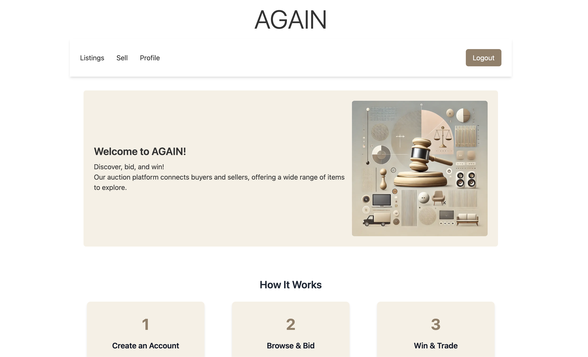

# Semester Project 2, Auction site "AGAIN"

Goal for this project:
To take the skills learned over the past three semesters and create an auction website.

Project Description: 
The AGAIN Auction Platform is a web application that allows users to list items for auction and bid on items from other users. New users start with 1000 credits to use on the platform. The frontend is built with Tailwind CSS and JavaScript, while all backend interactions are handled via the provided API.

Links: 

Gannt chart in Github Project: https://github.com/users/KineOnes/projects/1/views/2

Gannt chart in excel (Addition for myself for color sorting): https://noroff-my.sharepoint.com/:x:/g/personal/kinver22534_stud_noroff_no/EfGuwb_ELc9MvkJW85TI3iQBesn8tYNsxUCmWmDnsAh3PQ?e=RXdmKH

Netlify link: https://again-auction-site.netlify.app/

Figma link to prototype: https://www.figma.com/design/529foYlVrof5dpnz2R68TD/Untitled?node-id=0-1&t=nlN0cUOVjIiwb9EE-1

Trello board link: https://trello.com/invite/b/679a07543359d654a6c135d9/ATTIc5c58d94dd801d9be297f6db5eab3d739DA55CD9/sp2-auction-site / https://trello.com/b/oHPPp421/sp2-auction-site

